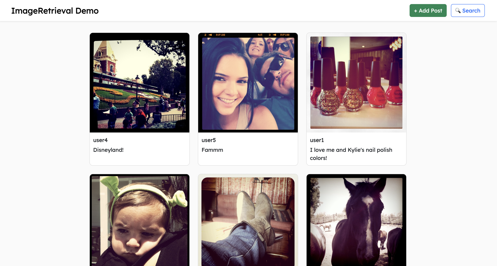
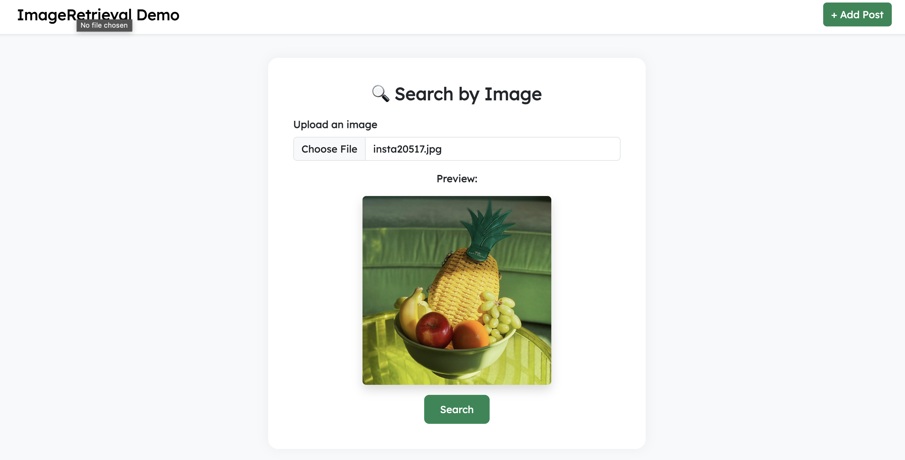
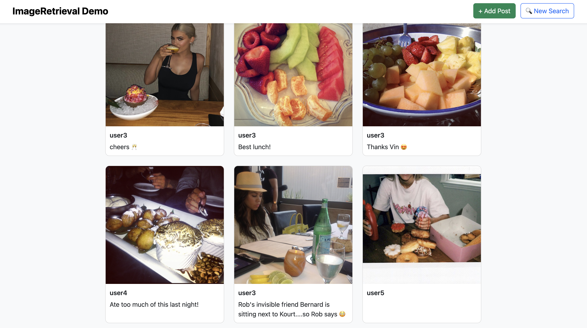

# Image Search Social Network

A full-stack web application that enables users to upload, view, and search for visually similar images using deep learning and scalable vector search. Built with **Django**, **CLIP** for image embeddings, and **FAISS** for fast Approximate Nearest Neighbor (ANN) search.

---

## Features

- Social network interface for posting images and captions
- Image similarity search powered by **CLIP + FAISS**
- Scalable ANN indexing: IVF, HNSW, IVFPQ
- Benchmark scripts to compare linear vs. ANN search
- Real-time embedding extraction using pretrained CLIP model
- AJAX-based "Load More" for feed scalability

---

## Tech Stack

| Component         | Technology                          |
|------------------|--------------------------------------|
| Backend          | Django                               |
| Frontend         | HTML, Bootstrap, JavaScript          |
| Embedding Model  | [CLIP ViT-B/32](https://github.com/openai/CLIP) |
| Vector Search    | [FAISS](https://github.com/facebookresearch/faiss) |
| Database         | SQLite (can upgrade to PostgreSQL)   |
| Dataset          | [Instagram Images with Captions](https://www.kaggle.com/datasets/prithvijaunjale/instagram-images-with-captions) |

---

## Screenshots

### Home Feed Page
Displays uploaded images with captions and a “Load More” button.

---

### Create New Post
Form to upload an image and optional caption.

---

### Image Search
Upload an image and retrieve visually similar results using FAISS.

---

### Search Results
Retrieved posts ranked by similarity.

